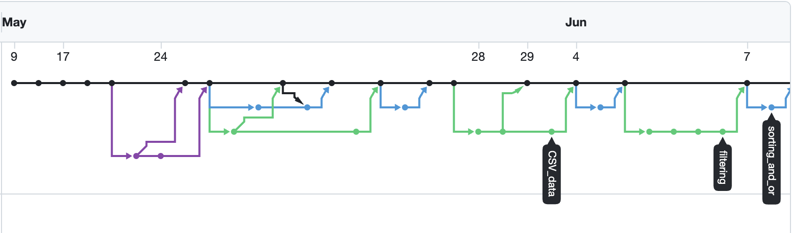

```{r setup, include=FALSE}
knitr::opts_chunk$set(echo = TRUE)
```

The objective of this exercise is for you to practice working together as a team on a data science project. Although there will be coding involved, it is meant to be rather easy, so you can focus your energy on the following important things:

-   Dividing tasks between group members in a way that is fair and that plays to your strengths
-   Reflecting on what authors (and you) can do to make their analysis reproducible
-   Keeping a tidy folder structure
-   Collaborating on GitHub, using branches and pull requests
-   Coordinating within the group, so that you all follow the same conventions (e.g. plot themes, heading types, etc.)
-   Communicating and supporting one another

The deliverable for this assessment will be a document that you submit via the TurnItIn inbox on Learn. In this document, you will need to include two things:

1.  Link to a private GitHub repo where you have stored your work on this project. Before submitting, you should add the programme staff to this repo as collaborators. Here are our GitHub usernames: `edinkasia`, `LailaNh`, `SophieMdP`, `emilianovidela93`.
2.  A 500-word reflective essay on how you found working on this task in a group.

The remaining part of this document explains what exactly you need to do within your project.

**NOTE: As you will be working on different GitHub branches and frequently merging into the main, it’s important that you always start your work by pulling from GitHub. This will give you the latest version of the work, and will help you avoid merge conflicts.**

## What do we need to do?

The published article by Walczak-Kozlowska et al. and the associated dataset are available in the assessment repository (<https://github.com/DDI-Talent/UG-research-design-assessment-2025-26>).

A key part of the submission will be a GitHub repository with contributions from all group members, made using branches and reviewed with pull requests. This repository will be a fork of the repository linked above (more on this later).

Here are the tasks that you’ll need to complete as a team:

1.  Reproduce figures 3, 4 and 5 from the paper. Present each figure in two versions: one version as close to the original as possible, and one version that is improved. Under each pair, explain how you have improved the figure and why you consider this an improvement (300 words in total).
2.  Assess the dataset from the point of view of FAIR data principles. Which aspects are already met, and how could FAIR-ness be improved? (300 words)
3.  Imagine that you are a reproducibility consultant working for the authors. Write a short brief where you explain what they are already doing well, and how they could improve the reproducibility of their work (300 words).

And here is the task that you’ll need to complete individually (you will not put this in the GitHub repo):

4.  Write a 500-word reflective essay on how you found working on this task in a group.

## How do we do this?

We suggest the following steps (some of them will take more time than others):

1.  One person will do the initial setup. Nominate a team member to do this.
2.  The nominated team member should go to the assessment repository (<https://github.com/DDI-Talent/UG-research-design-assessment-2025-26>) and create a fork of that repo.
3.  Add the other group members as collaborators in the “Settings \> Collaborators” section of your (forked) repo on github.com. Group members should check their email and accept the invitation to join the repo.
4.  All group members should clone this repository and save it in the location where you’d like to do your work (e.g. the folder for your Research Design work). This will be the main folder in which you store all your work for this exercise.
5.  At this point, each group member should have the same folder structure and the same files as you can see on github.com.
6.  Familiarise yourself with the files and folders in this repo. The `project-report-template.rmd` gives you a starting point for your report. Use the `Save as` functionality in RStudio to save a copy of this file, rename it, and use that copy to write your report.
7.  Assign each figure to a team member. Ask the team member to work on a separate branch, and only create a pull request when their visualisation is considered. Let another team member check the figure and respond to the pull request. Merge the branch into main, but don’t delete it – we will want to see your network diagram when marking. An example network diagram looks like this (each colour represents a different branch):



8.  As a group, work on Tasks 2 and 3, making sure that you present a coherent response. Add these tasks to the report (this is also best done using branches and pull requests -  create separate branches for each task, and only merge into main when you're happy with the content).
9. When you are finished, you should have all parts of the report in your .Rmd document, on the `main` branch of your repository. You can knit your .Rmd file to html and see whether everything looks as expected. The markers will also knit to html when assessing your work. 

## What do I submit?

Each person individually will need to upload a single document to the submission box on Learn. This document should include a link to your group’s GitHub repository and your 500-word individual reflective account. It can be a Word document or a pdf.
